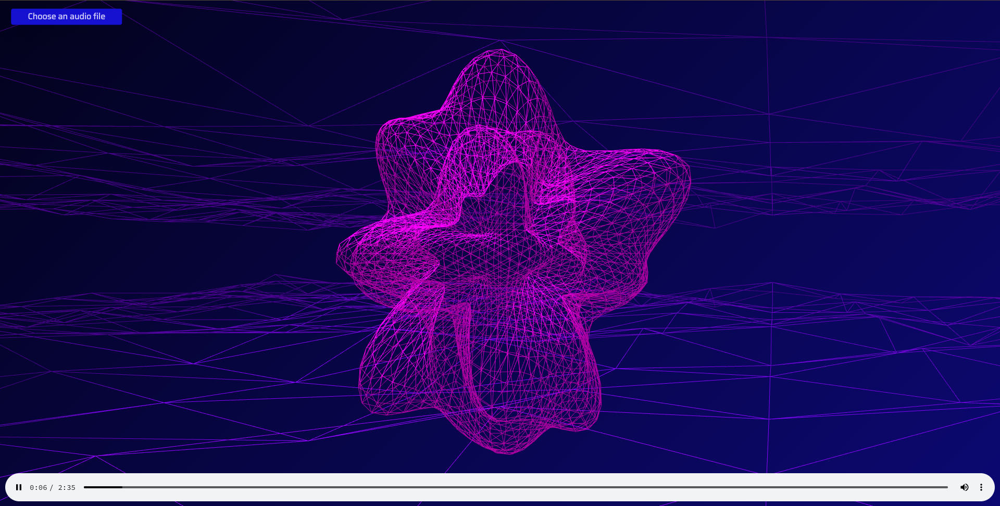

# Audio Visualization with three.js

This project demonstrates audio visualization using the powerful 3D graphics library, three.js. The visualization reacts to audio input, creating a dynamic and engaging visual experience.

Here is the look!
## Table of Contents
- [Introduction](#introduction)
- [Features](#features)
- [Installation](#installation)
- [Usage](#usage)
- [Files](#files)

## Introduction
Audio Visualization with three.js is a mini-project aimed at showcasing the capabilities of three.js in creating interactive and visually appealing audio visualizations.

## Features
- Real-time audio analysis
- Dynamic 3D visualizations
- Interactive controls

